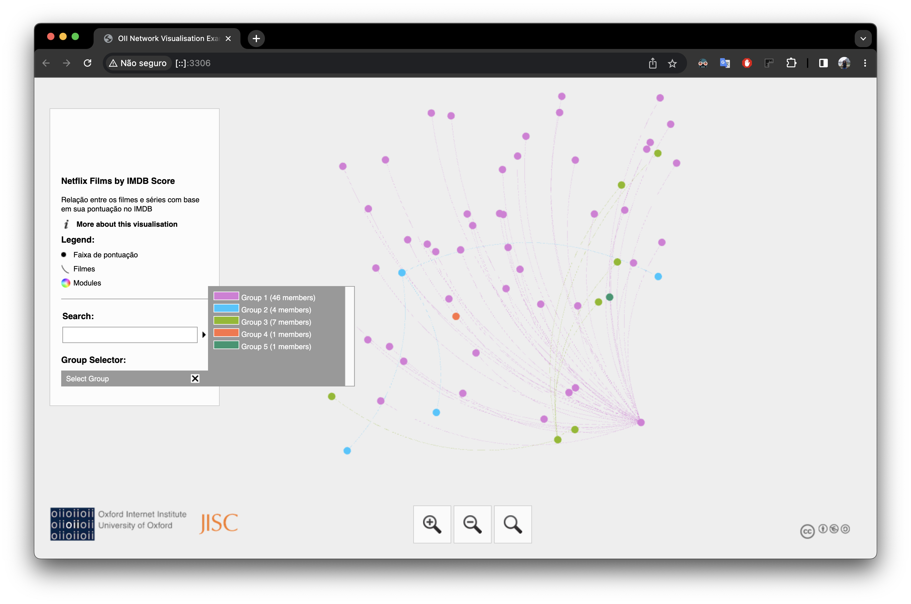

## Visualização de gráficos usando a biblioteca Javascript (sigma.js)

> Aqui foi gerado um arquivo chamado scores.graphml, você pode acessá-lo na pasta [pyvis_analysis](https://github.com/nataly-enne/network_analysis/tree/main/u3_project/pyvis_analysis)

O arquivo `scores.graphml` cria uma relação entre os filmes com base em sua pontuação no IMDB. Cada nó representa uma faixa de pontuação (por exemplo, 0-1, 1-2, 2-3, etc.) e as arestas seriam adicionadas entre os filmes que estão dentro da mesma faixa de pontuação.

### Build Setup (rodar localmente):
```bash
python3 -m http.server 3306 # pode utilizar outra porta
```

### Para versões do python inferiores a 3.0, utilize:
```bash
python -m SimpleHTTPServer 3306 
```

### Print da tela com o projeto rodando localmente:

